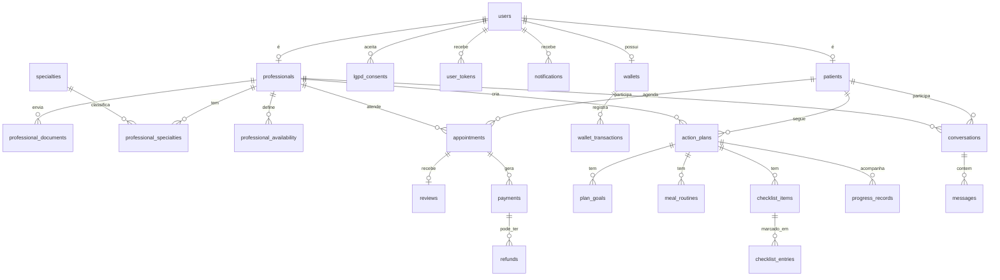

# 🗄️ Banco de dados do NutriMente

Guia para rodar e entender a infraestrutura de dados do projeto. Não é preciso instalar SQL Server nem MongoDB no seu computador: tudo roda no **Docker**.

## Arquitetura

```text
 Next.js (front)
      │  HTTP
      ▼
 API Java (Spring Boot) ──────────► SQL Server  (dados: usuários, consultas, planos...)
      │  HTTP (x-api-key)
      ▼
 logs-service (Node.js) ──────────► MongoDB     (logs: aplicação, acesso, auditoria LGPD)
```

| Peça | Tecnologia | Para quê |
|---|---|---|
| `database/sqlserver` | SQL Server 2022 | Dados principais, relacionais, com regras de integridade |
| `database/mongodb` | MongoDB 8 | Logs: volume alto, formato flexível, apagados sozinhos depois de um prazo |
| `services/logs-service` | Node.js 22 + Express | Recebe logs por HTTP e grava no MongoDB |

**Por que dois bancos?** Dados de negócio (consultas, pagamentos) precisam de relações e garantias fortes: é o ponto forte do SQL. Logs são muitos, cada um com campos diferentes, e só são escritos e consultados de vez em quando: é onde o MongoDB se encaixa melhor. Assim os logs também não pesam no banco principal.

## Como rodar

Pré-requisito: [Docker Desktop](https://www.docker.com/products/docker-desktop/) aberto.

```bash
# 1. Crie seu .env a partir do exemplo (e troque as senhas)
cp .env.example .env

# 2. Suba tudo (a 1ª vez demora: baixa as imagens)
docker compose up -d --build

# 3. Confira: os três devem aparecer como "healthy"
docker compose ps
```

Na primeira vez, os scripts criam o banco, as tabelas e os dados iniciais automaticamente. Para acompanhar:

```bash
docker compose logs -f sqlserver   # procure por "Banco de dados criado com sucesso"
```

### Comandos do dia a dia

| Comando | O que faz |
|---|---|
| `docker compose up -d` | Liga os containers |
| `docker compose down` | Desliga (os dados **continuam** salvos) |
| `docker compose down -v` | Desliga e **apaga todos os dados**; na próxima subida o banco é recriado do zero |
| `docker compose logs -f <serviço>` | Mostra os logs de um container |

> ⚠️ Os scripts `.sql` e `.js` só rodam quando o banco **ainda não existe**. Se você alterar um script, rode `docker compose down -v` e suba de novo para ver a mudança (isso apaga os dados locais).

### Conectando com um cliente visual

Use **Azure Data Studio**, **DBeaver** ou **SSMS** para o SQL Server e **MongoDB Compass** para o Mongo.

| | SQL Server | MongoDB |
|---|---|---|
| Host | `localhost`, porta `1433` | `mongodb://localhost:27017` |
| Usuário da aplicação | `NUTRIMENTE_DB_USER` do `.env` | `MONGO_APP_USER` do `.env` (authSource: `nutrimente_logs`) |
| Administrador | `sa` / `MSSQL_SA_PASSWORD` | `MONGO_ROOT_USER` / `MONGO_ROOT_PASSWORD` |
| Observação | Marque "Trust server certificate" | |

## Estrutura de pastas

```text
database/
├── sqlserver/
│   ├── Dockerfile              # imagem do SQL Server com nossos scripts
│   ├── entrypoint.sh           # liga o banco e roda os scripts na 1ª vez
│   └── scripts/                # executados em ordem alfabética
│       ├── 01-create-database.sql   # banco + usuário da aplicação
│       ├── 02-create-tables.sql     # tabelas, regras e índices
│       └── 03-seed.sql              # dados iniciais (especialidades)
└── mongodb/
    └── init/
        └── 01-init-logs.js     # collections de log, validação e TTL
tests/                          # testes de integração dos dois bancos
demo/                           # script de dados de demonstração (npm run seed)
services/
└── logs-service/               # API Node.js de logs
    ├── src/app.js              # rotas
    ├── src/server.js           # conecta no Mongo e liga o servidor
    └── test/                   # testes de integração da API
```

## Modelo de dados (SQL Server)



Como ler: `||--o{` significa "um para muitos" (um paciente tem várias consultas); `||--o|` significa "um para zero ou um".

| Grupo | Tabelas | Funcionalidade do README principal |
|---|---|---|
| Usuários | `users`, `patients`, `professionals`, `professional_documents`, `specialties`, `professional_specialties` | Cadastro, perfis, verificação, busca por especialidade/preço |
| Autenticação/LGPD | `user_tokens`, `lgpd_consents` | Confirmação de e-mail, esqueci a senha, consentimentos |
| Agenda | `professional_availability`, `appointments`, `reviews` | Agendamento, horários, avaliações |
| Plano de ação | `action_plans`, `plan_goals`, `meal_routines`, `checklist_items`, `checklist_entries`, `progress_records` | Planos, metas, rotinas, checklists, progresso |
| Comunicação | `conversations`, `messages`, `notifications` | Chat e notificações |
| Financeiro | `wallets`, `wallet_transactions`, `payments`, `refunds` | Carteira, pagamentos, reembolsos |

### Decisões importantes (e por quê)

- **Datas em UTC**: o banco grava sempre em UTC e o front converte para o horário de Brasília. Evita bugs de horário de verão e fuso.
- **Senha e tokens só como hash**: a API Java usa BCrypt para senhas e SHA-256 para tokens de redefinição. Se o banco vazar, ninguém consegue logar com o que está lá.
- **Usuário da aplicação limitado**: a API conecta com `nutrimente_app`, que lê e grava dados mas **não** pode criar ou apagar tabelas.
- **Agendamento duplicado bloqueado pelo banco**: um índice único filtrado impede dois agendamentos ativos no mesmo horário de início. Sobreposição parcial (13:00 e 13:30) ainda precisa ser checada na API.
- **Um pagamento `PAID` por consulta**: também garantido por índice único filtrado.
- **Saldo da carteira com `ROWVERSION`**: evita saldo errado quando duas operações acontecem ao mesmo tempo (mapeie com `@Version` no JPA).
- **Consultas e pagamentos não são apagados em cascata**: é histórico financeiro e clínico.
- **Busca sem acento**: a collation `CI_AI` faz `psicologo` encontrar `Psicólogo`.

## Logs (MongoDB)

| Collection | O que guarda | Guardado por |
|---|---|---|
| `application_logs` | Erros e requisições das aplicações | 90 dias |
| `access_logs` | Logins, logouts, recuperação de senha | 1 ano |
| `audit_logs` | Quem acessou/alterou dados pessoais e de saúde (LGPD) | 5 anos |

Os documentos antigos são apagados automaticamente (índice **TTL**). Cada collection tem validação: um log fora do formato é recusado.

### Enviando um log (exemplo)

```bash
curl -X POST http://localhost:4000/logs/audit   -H "x-api-key: <LOGS_API_KEY do .env>"   -H "Content-Type: application/json"   -d '{"actorId": 2, "actorRole": "PROFESSIONAL", "action": "READ",
       "entity": "progress_records", "entityId": 10, "subjectUserId": 1}'
```

- `POST /logs/application | /logs/access | /logs/audit`: aceita um objeto ou um array de até 500 (envie em lote sempre que puder).
- `GET /logs/audit/{userId}`: histórico de quem acessou os dados daquele usuário.
- `GET /health`: status do serviço (sem chave).

⚠️ Nunca coloque senha, CPF completo ou conteúdo de consulta dentro de um log. Registre **o que** foi acessado (`entity` + `entityId`), não o dado em si.

## Testes de integração

Os testes em `database/tests/` conectam nos bancos **de verdade** (os containers) com os usuários da aplicação e conferem se as regras funcionam: e-mail único, CPF válido, agendamento duplicado bloqueado, um pagamento por consulta, cascatas, permissões, validação e expiração dos logs.

```bash
# Com os containers ligados (docker compose up -d)
cd database/tests
npm install     # só na primeira vez
npm test
```

Cada teste do SQL Server roda dentro de uma **transação desfeita no final** (ROLLBACK), e os do MongoDB apagam o que criaram. Por isso podem rodar a qualquer momento, sem sujar o banco.

Ao criar uma tabela ou regra nova, adicione um teste em `sqlserver.test.js` ou `mongodb.test.js` seguindo os exemplos.

## Dados de demonstração

O script `database/demo/seed-demo.mjs` enche o banco com dados realistas para desenvolver as telas e para a **apresentação**:

| O quê | Detalhes |
|---|---|
| 8 profissionais **aprovados** | 4 nutricionistas e 4 psicólogos, com foto, bio, valor, especialidades, horários de atendimento e avaliações |
| 1 profissional **pendente** | André Nogueira, para mostrar a aprovação pelo admin |
| 6 pacientes | Entre eles a paciente de demonstração **Ana Souza** |
| Consultas futuras | 8 agendadas pelo caminho normal da API (com link de vídeo nas online); a da Ana com a Camila já está **confirmada** |
| Histórico | Consultas realizadas em dias e horários da agenda de cada profissional, com 18 avaliações (a nota média aparece na busca) |
| Planos de ação | A Ana recebe 2 planos: nutrição (Camila: metas, cardápio, checklist e pesagens) e psicologia (Mariana: autocuidado). Os últimos 6 dias já vêm marcados; **o checklist de hoje fica em aberto** para marcar ao vivo |

```bash
# Com o back-end no ar (docker compose up -d --build)
cd database/demo
npm install     # só na primeira vez
npm run seed    # leva ~1 minuto
```

**Contas criadas** (senha de todas: `Demo1234`):

| Papel | E-mail | Para mostrar |
|---|---|---|
| Paciente | `ana@nutrimente.demo` | Próximas consultas (vídeo, cancelar, remarcar), histórico, avaliar a consulta com a Mariana e os 2 planos de ação |
| Nutricionista | `camila@nutrimente.demo` | Agenda movimentada (confirmar consultas), horários de atendimento, plano da Ana com a adesão da semana |
| Psicóloga | `mariana@nutrimente.demo` | Outro profissional com consultas |
| Admin | o `ADMIN_EMAIL` do `.env` | Fila de aprovação com o André |

- **Pode rodar de novo** quando quiser: antes de criar, o script apaga **só** as contas `@nutrimente.demo` e o que depende delas (consultas, avaliações). Nada mais é tocado. As datas são sempre relativas a hoje, então as "próximas consultas" continuam no futuro.
- Ele usa a própria API para cadastrar, aprovar e agendar (mesmas regras e senhas do uso real) e o banco direto só para confirmar e-mails, criar consultas **no passado** e avaliações.
- No fim, limpa a caixa do Mailpit.

**Jornada narrada (plano B da apresentação):** `npm run jornada` percorre busca → agendamento → confirmação → plano de ação → checklist → avaliação → segurança, falando com a API de verdade e mostrando cada passo no terminal. Ela altera os dados: depois, rode `npm run seed`. Ver [docs/APRESENTACAO.md](../docs/APRESENTACAO.md).

### Banco limpo para a apresentação

Os testes automáticos criam contas de teste (`@teste.local`), e às vezes alguma sobra aparece na busca. Antes da apresentação, recrie o banco do zero e rode o script:

```bash
docker compose down -v          # ⚠️ apaga TODOS os dados locais
docker compose up -d --build    # espere todos ficarem healthy (docker compose ps)
cd database/demo && npm run seed
```

**Depois disso, não rode os testes de ponta a ponta (`npm run test:e2e`) na máquina da apresentação**: eles criam contas novas. Se rodar, repita os três comandos acima.

## Conectando a API Java (Spring Boot)

`application.properties`:

```properties
spring.datasource.url=jdbc:sqlserver://localhost:1433;databaseName=NutriMente;encrypt=true;trustServerCertificate=true
spring.datasource.username=${NUTRIMENTE_DB_USER}
spring.datasource.password=${NUTRIMENTE_DB_PASSWORD}
# O banco é criado pelos scripts; o Hibernate só confere se as entidades batem
spring.jpa.hibernate.ddl-auto=validate
```

Dependência Maven: `com.microsoft.sqlserver:mssql-jdbc`. O bloco `api` já está preparado (comentado) no `docker-compose.yml`, para quando o backend existir.
