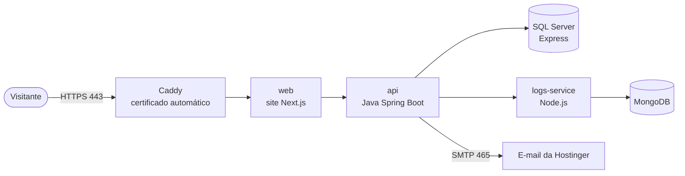

# 🚀 Deploy (passo a passo)

Como colocar o NutriMente no ar em **https://nutrimente.tech**, com HTTPS, num **servidor VPS**: na **DigitalOcean** (créditos do GitHub Student Pack, o caminho escolhido) ou na **Hostinger**. Os passos são os mesmos; só a criação do servidor (passo 1) e o e-mail (passo 5) mudam.

Tempo estimado: **1 a 2 horas** na primeira vez. Boa parte disso é esperar o DNS propagar e o Docker baixar as imagens.

---

## 0. Antes de começar: qual plano contratar

O NutriMente roda **SQL Server, MongoDB, API Java, serviço Node e o site Next.js**. Por isso:

| Servidor | Serve? | Por quê |
|---|---|---|
| Hospedagem compartilhada da Hostinger (Premium, Business, **Cloud Startup**) | ❌ **Não** | Não roda Docker, Java nem SQL Server |
| **DigitalOcean, Droplet de 8 GB** (US$ 48/mês) | ✅ **Escolhido** | Pago com os **US$ 200 de crédito do GitHub Student Pack** (cobre ~4 meses). Para esticar o crédito: Droplet de 4 GB (US$ 24/mês) + swap, mais lento |
| Hostinger **VPS KVM 1** (4 GB de RAM) | ⚠️ No limite | Só o SQL Server pede 2 GB. Funciona para demonstração, mas fica lento |
| Hostinger **VPS KVM 2** (8 GB de RAM) | ✅ Alternativa paga | Folga para tudo, inclusive para compilar no próprio servidor |

Você também vai precisar de:

- **O domínio:** `nutrimente.tech` (registrado no **get.tech**, pelo Student Pack).
- **Envio de e-mail** com o domínio (`nao-responda@nutrimente.tech`): é por ele que saem os e-mails de confirmação e de nova senha. Usamos o **Brevo** (grátis até 300 por dia), porque a DigitalOcean bloqueia as portas de e-mail comuns (ver passo 5).
- Acesso ao repositório no GitHub.

> 💡 Nos exemplos abaixo, troque `203.0.113.10` pelo IP do seu servidor.

### Como fica no servidor



Só o **Caddy** fica exposto na internet (portas 80 e 443). Bancos, API e serviço de logs só existem dentro da rede interna do Docker.

---

## 1. Criar o servidor

### 1.A DigitalOcean (Student Pack), o caminho escolhido

1. Ative o crédito em https://education.github.com/pack → **DigitalOcean** → crie a conta pelo link do pacote (o crédito só vale assim).
2. **Create → Droplets**:
   - **Região:** New York ou Toronto (não há região no Brasil; a diferença de velocidade é pequena).
   - **Imagem:** Marketplace → **Docker on Ubuntu 24.04** (já vem com Docker; senão, Ubuntu 24.04 e o passo 3.2).
   - **Tamanho:** Basic → Regular → **8 GB / 4 vCPU** (ou 4 GB, ver tabela acima).
   - **Autenticação:** **SSH Key** (gere no seu PC com `ssh-keygen -t ed25519` e cole o conteúdo de `~/.ssh/id_ed25519.pub`).
   - **Backups:** opcional (+20%). O `deploy/backup.sh` (passo 10) já faz backups diários.
   - **Hostname:** `nutrimente`.
3. Anote o **IP** (ipv4) do Droplet.
4. Em **Networking → Firewalls**, crie um firewall com entrada **só** nas portas 22, 80 e 443 (TCP) e 443 (UDP), e aplique no Droplet.

### 1.B Hostinger (alternativa paga)

1. No **hPanel**, vá em **VPS** e contrate o plano.
2. Na configuração inicial:
   - **Sistema operacional:** escolha **Ubuntu 24.04 com Docker**. Ele aparece em "Aplicativos" / "Sistema operacional com aplicativo". Se não houver, escolha **Ubuntu 24.04** puro e siga o passo 3.2.
   - **Localização:** a mais próxima do público (ex.: São Paulo, se disponível).
   - **Senha do root:** crie uma forte e guarde num gerenciador de senhas.
   - **Chave SSH:** recomendado. Se você não tem uma, gere no seu PC com `ssh-keygen -t ed25519` e cole o conteúdo de `~/.ssh/id_ed25519.pub`.
3. Anote o **IP do VPS**, que aparece na visão geral.

## 2. Apontar o domínio para o servidor (DNS)

O `nutrimente.tech` é gerenciado no **get.tech** (painel em https://controlpanel.tech, com o login do registro): **Manage Domain → DNS Management**. (Na Hostinger: **Domínios → seu domínio → DNS / Nameservers**.) Deixe assim:

| Tipo | Nome | Aponta para | TTL |
|---|---|---|---|
| A | `@` | `203.0.113.10` (IP do VPS) | 300 |
| A | `www` | `203.0.113.10` | 300 |

- Apague registros **A** ou **CNAME** antigos de `@` e `www` que apontem para outro lugar (ex.: o "site padrão" da Hostinger).
- **Não mexa** nos registros **MX** e **TXT** (SPF/DKIM): são os do e-mail.

A propagação leva de minutos a algumas horas. Para conferir, no seu PC:

```bash
nslookup nutrimente.tech
```

Quando responder com o IP do VPS, pode seguir. **O HTTPS só funciona depois disso.**

## 3. Preparar o servidor

### 3.1 Entrar no servidor

No terminal do seu PC (PowerShell, Git Bash ou Terminal do Mac):

```bash
ssh root@203.0.113.10
```

Também dá para usar o **Terminal do navegador** no hPanel (VPS → Visão geral → "Terminal").

### 3.2 Atualizar o sistema e instalar o Docker

```bash
apt update && apt upgrade -y
apt install -y git ufw

# Só se escolheu Ubuntu puro (sem Docker) no passo 1:
curl -fsSL https://get.docker.com | sh
```

Confira:

```bash
docker --version
docker compose version   # precisa ser 2.24 ou mais nova
```

### 3.3 Firewall

Libera só SSH, HTTP e HTTPS:

```bash
ufw allow OpenSSH
ufw allow 80/tcp
ufw allow 443/tcp
ufw allow 443/udp
ufw --force enable
ufw status
```

> ⚠️ **Por que os bancos estão seguros mesmo assim:** o Docker passa por cima do `ufw` nas portas que publica. Por isso o `docker-compose.prod.yml` **não publica** as portas dos bancos, da API nem dos logs (`ports: !reset []`). Nunca acrescente `ports:` nesses serviços em produção.
>
> Se o hPanel tiver um **Firewall do VPS** ativo, libere nele as mesmas portas (22, 80, 443).

### 3.4 Memória extra (swap)

Evita que o servidor trave ao compilar a API e o site:

```bash
fallocate -l 4G /swapfile && chmod 600 /swapfile
mkswap /swapfile && swapon /swapfile
echo '/swapfile none swap sw 0 0' >> /etc/fstab
free -h
```

## 4. Baixar o projeto

```bash
cd /opt
git clone https://github.com/linsjulia/NutriMente.git nutrimente
cd nutrimente
```

**Se o repositório for privado**, crie uma chave só de leitura para o servidor:

```bash
ssh-keygen -t ed25519 -C "deploy-nutrimente" -f ~/.ssh/github_deploy -N ""
cat ~/.ssh/github_deploy.pub
```

1. No GitHub, abra o repositório e vá em **Settings → Deploy keys → Add deploy key**.
2. Cole a chave e **não** marque "Allow write access".
3. Clone usando essa chave:

```bash
GIT_SSH_COMMAND="ssh -i ~/.ssh/github_deploy" git clone git@github.com:linsjulia/NutriMente.git /opt/nutrimente
cd /opt/nutrimente
git config core.sshCommand "ssh -i ~/.ssh/github_deploy"
```

## 5. Envio de e-mail

### 5.A Brevo (padrão; obrigatório na DigitalOcean)

A DigitalOcean **bloqueia as portas 25, 465 e 587** (envio de e-mail) em contas novas. O Brevo aceita a porta **2525**, que não é bloqueada:

1. Crie a conta grátis em https://www.brevo.com.
2. **Senders, Domains & Dedicated IPs → Domains → Add a domain**: `nutrimente.tech`. O Brevo mostra registros **TXT** (código de verificação, **DKIM** e **DMARC**): crie cada um no DNS do get.tech (passo 2) e clique em **Verify**. Sem isso, os e-mails caem no spam.
3. **Senders → Add a sender**: `NutriMente <nao-responda@nutrimente.tech>`.
4. **SMTP & API → SMTP**: copie o **login** e gere uma **SMTP key**. Eles vão no `.env` (passo 6) como `MAIL_USERNAME` e `MAIL_PASSWORD`; o resto (`smtp-relay.brevo.com`, porta 2525, STARTTLS) já vem no modelo.

### 5.B E-mail da Hostinger (só se o servidor liberar a porta 465)

1. No hPanel, vá em **E-mails → seu domínio → Criar conta de e-mail**: `nao-responda@nutrimente.tech`, com uma senha forte.
2. Os dados de envio (SMTP) da Hostinger são:

| Campo | Valor |
|---|---|
| Servidor | `smtp.hostinger.com` |
| Porta | `465` (SSL) |
| Usuário | o e-mail completo |
| Senha | a senha da caixa |

Se o domínio está na Hostinger, os registros **SPF** e **DKIM** já vêm configurados. Sem eles, os e-mails caem no spam. Confira em **E-mails → Configurações de DNS**.

## 6. Configurar o `.env` de produção

O jeito mais fácil: o script gera **todas** as senhas e chaves fortes e só deixa o e-mail para você:

```bash
bash deploy/gerar-env.sh nutrimente.tech seu-email@exemplo.com
nano .env      # preencha MAIL_USERNAME e MAIL_PASSWORD (passo 5)
```

Ele mostra na tela a **senha do admin** e a **`RECORDS_ENCRYPTION_KEY`**: **guarde as duas fora do servidor** (gerenciador de senhas) antes de continuar. O script não sobrescreve um `.env` que já existe.

**Ou à mão:** `cp .env.production.example .env && nano .env` e preencha **todos** os valores marcados com `TROQUE`. Gere cada senha ou chave com:

```bash
openssl rand -hex 24
```

| Variável | O que colocar |
|---|---|
| `DOMAIN` | Só o domínio, sem `https://` e sem `www`: `nutrimente.tech` |
| `MSSQL_SA_PASSWORD`, `NUTRIMENTE_DB_PASSWORD` | Uma chave gerada **+ `Aa1!` no final** (o SQL Server exige maiúscula, minúscula, número e símbolo) |
| `MONGO_ROOT_PASSWORD`, `MONGO_APP_PASSWORD`, `LOGS_API_KEY` | Uma chave gerada cada |
| `JWT_SECRET` | `openssl rand -hex 32` (64 caracteres) |
| `RECORDS_ENCRYPTION_KEY` | `openssl rand -hex 32`. Criptografa prontuário, questionário, triagem e CPF/telefone/nascimento. **Guarde uma cópia fora do servidor**: sem ela, os registros do backup não podem ser lidos |
| `ADMIN_EMAIL`, `ADMIN_PASSWORD` | O primeiro administrador. Senha com letras e números, 8+ caracteres |
| `MAIL_USERNAME`, `MAIL_PASSWORD` | Login e SMTP key do Brevo (passo 5.A) ou a caixa da Hostinger (5.B) |
| `MAIL_FROM` | `NutriMente <nao-responda@nutrimente.tech>` (o remetente verificado no Brevo) |

- No `nano`, salve com `Ctrl+O`, `Enter` e saia com `Ctrl+X`.
- Proteja o arquivo: `chmod 600 .env`

> A linha `COMPOSE_FILE=docker-compose.yml:docker-compose.prod.yml` (já no exemplo) faz o `docker compose` usar a configuração de produção automaticamente. Não apague.

## 7. Subir tudo

```bash
docker compose up -d --build
```

Na primeira vez demora **de 10 a 20 minutos**: baixa o SQL Server (~1,5 GB), compila a API Java e o site. Acompanhe:

```bash
docker compose ps
```

Espere todos ficarem **`healthy`** (ou `running`, no caso do Caddy):

```
nutrimente-sqlserver      healthy
nutrimente-mongodb        healthy
nutrimente-logs-service   healthy
nutrimente-api            healthy
nutrimente-web            healthy
nutrimente-caddy          running
```

Se algum ficar reiniciando, veja o motivo:

```bash
docker compose logs --tail=50 api      # troque "api" pelo serviço
```

## 8. Conferir se está no ar

1. Abra **https://nutrimente.tech**. Deve aparecer o cadeado. O certificado é emitido sozinho na primeira visita e pode levar 1 minuto.
2. **http://** e **www** devem redirecionar para `https://nutrimente.tech`.
3. Faça um cadastro de paciente com um e-mail seu: o e-mail de confirmação deve chegar (olhe o spam na primeira vez).
4. Entre com o `ADMIN_EMAIL`. Depois, em **Minha conta**, troque a senha do admin.
5. Confira que os bancos **não** estão expostos. No seu PC, isto deve dar erro ou tempo esgotado:

```bash
curl -m 5 http://203.0.113.10:8080/actuator/health
```

## 9. Atualizar o site (novas versões)

Sempre que algo novo entrar na `main`:

```bash
cd /opt/nutrimente
git pull
docker compose up -d --build
docker image prune -f      # apaga imagens antigas (libera disco)
```

Só os serviços que mudaram são recriados. O site fica fora do ar por alguns segundos.

> ⚠️ **Mudanças no banco (arquivos `.sql`)**: os scripts de `database/sqlserver/scripts` só rodam na **primeira** criação do banco. Em produção **nunca** use `docker compose down -v`, porque **apaga todos os dados**. Até o projeto ter migrations (Flyway, item do backlog), mudanças de tabela precisam ser aplicadas à mão com `sqlcmd` (peça ajuda no grupo).

## 10. Backups

O script `deploy/backup.sh` salva o SQL Server, o MongoDB e as **fotos do diário alimentar** (volume `api-uploads`) em `/root/backups-nutrimente`, e apaga os arquivos com mais de 14 dias. As fotos e vários campos do banco são **cifrados**: guarde a `RECORDS_ENCRYPTION_KEY` (ou o `JWT_SECRET`, se ela estiver vazia) **fora do servidor**, junto com os backups.

```bash
bash deploy/backup.sh
```

Para rodar **todo dia às 3h**:

```bash
crontab -e
```

Acrescente a linha:

```
0 3 * * * cd /opt/nutrimente && bash deploy/backup.sh >> /var/log/nutrimente-backup.log 2>&1
```

> 💾 Backup no mesmo servidor não protege se o VPS for perdido. Copie os arquivos para fora de tempos em tempos (ex.: `scp root@203.0.113.10:/root/backups-nutrimente/* .` no seu PC). Ative também os **backups semanais/snapshots do VPS** no hPanel.

**Restaurar o SQL Server** a partir de um `.bak`:

```bash
docker cp /root/backups-nutrimente/NutriMente_AAAA-MM-DD_HHMM.bak nutrimente-sqlserver:/var/opt/mssql/backup/restore.bak
docker compose stop api
docker exec -it nutrimente-sqlserver /opt/mssql-tools18/bin/sqlcmd -S localhost -U sa -C \
  -Q "RESTORE DATABASE NutriMente FROM DISK = N'/var/opt/mssql/backup/restore.bak' WITH REPLACE"
docker compose start api
```

(o comando pede a senha `MSSQL_SA_PASSWORD`)

## 11. Comandos do dia a dia

| Para... | Comando (dentro de `/opt/nutrimente`) |
|---|---|
| Ver o status | `docker compose ps` |
| Ver os logs de um serviço | `docker compose logs -f --tail=100 web` |
| Reiniciar um serviço | `docker compose restart api` |
| Desligar tudo (dados mantidos) | `docker compose down` |
| Ligar de novo | `docker compose up -d` |
| Uso de memória e CPU | `docker stats --no-stream` |
| Espaço em disco | `df -h` e `docker system df` |

Depois de reiniciar o VPS, tudo volta sozinho (`restart: unless-stopped`).

## 12. Problemas comuns

| Sintoma | Causa provável | Solução |
|---|---|---|
| Navegador diz "não seguro" / sem cadeado | DNS ainda não aponta para o VPS, ou porta 80/443 bloqueada | Confira o `nslookup` (passo 2) e o firewall (passo 3.3). Depois `docker compose restart caddy` e veja `docker compose logs caddy` |
| `nutrimente-sqlserver` reiniciando | Senha fraca no `.env` ou pouca memória | Senha com `Aa1!` no fim; veja `free -h`; em VPS de 4 GB, use `MSSQL_MEMORY_LIMIT_MB=1536` |
| `nutrimente-api` unhealthy | Senha do banco diferente da usada na primeira subida, ou `JWT_SECRET` curto | As senhas do banco são gravadas na **primeira** subida: não as troque depois só no `.env` |
| E-mails não chegam | Dados SMTP errados, ou caem no spam | `docker compose logs api \| grep -i mail`; confira usuário/senha; confira SPF/DKIM (passo 5) |
| Página de erro "Algo deu errado" | API fora do ar | `docker compose ps` e `docker compose logs api` |
| Servidor muito lento | Memória esgotada | `docker stats --no-stream`; considere o KVM 2 |
| `service "mailpit" ... profiles` ou erro com `!reset`/`!override` | Docker Compose antigo | Atualize: `apt install docker-compose-plugin` (precisa da versão 2.24+) |

## Ensaio local da produção (antes de contratar o servidor)

Dá para subir a versão de produção (Caddy com HTTPS + site em contêiner + API e bancos sem portas abertas) no próprio PC, com o domínio `localhost`:

```bash
export DOMAIN=localhost MAIL_HOST=smtp.invalid MAIL_FROM="NutriMente <nao-responda@localhost>"
docker compose -f docker-compose.yml -f docker-compose.prod.yml up -d --build
curl -k https://localhost/          # 200
curl -I http://localhost/           # 308, redireciona para https
curl http://localhost:8080          # não responde: a API não fica exposta (certo)
```

- O Caddy cria um certificado **local** para `localhost`; o navegador avisa que não é confiável (normal). **Antivírus que inspecionam HTTPS (ex.: Kaspersky) bloqueiam a página**: teste com `curl -k` ou desligue a inspeção de HTTPS para `localhost` no antivírus. No servidor real, o certificado é do Let's Encrypt e não há aviso.
- Os e-mails não saem (`MAIL_HOST` falso): normal no ensaio.
- **Para voltar ao desenvolvimento:** `docker rm -f nutrimente-caddy nutrimente-web` e `docker compose up -d --build`. Os dados continuam.

Ensaio feito em 09/10: tudo "healthy", HTTPS 200, HTTP → HTTPS, API e bancos fechados, cabeçalhos de segurança (HSTS incluído) presentes.

## Checklist de segurança

- [ ] `.env` com `chmod 600`, senhas geradas (nada de `TROQUE`)
- [ ] Senha do admin trocada depois do primeiro login
- [ ] `ufw` ativo só com 22, 80 e 443
- [ ] `curl http://IP:8080` (de fora) **não** responde
- [ ] Backup diário no cron **e** cópia fora do servidor
- [ ] Root com chave SSH (opcional: desativar login por senha em `/etc/ssh/sshd_config`, `PasswordAuthentication no`)
- [ ] Revisão jurídica dos Termos e da Política de Privacidade antes de abrir para o público (item do backlog)
