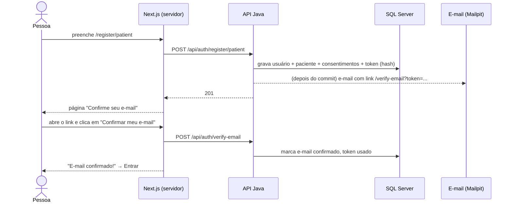
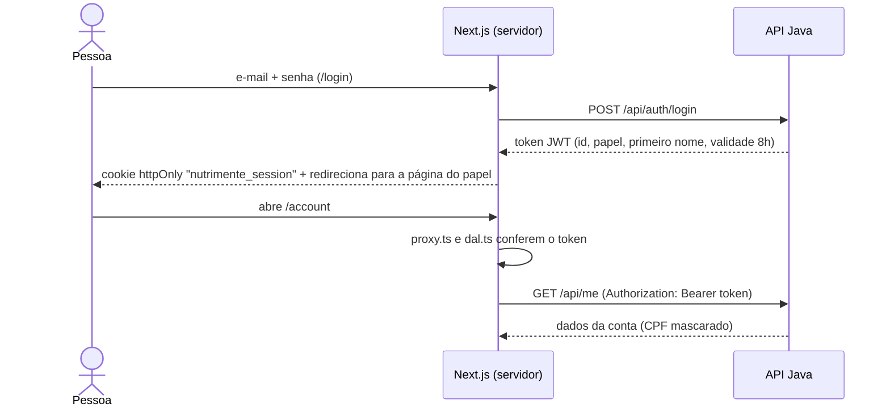

# 👥 Papéis e fluxos do NutriMente

Mapa de **quem pode fazer o quê** e de **como cada fluxo funciona**, do navegador até o banco.

## 1. Papéis (roles)

| | Paciente (`PATIENT`) | Profissional (`PROFESSIONAL`) | Administrador (`ADMIN`) |
|---|---|---|---|
| **Quem é** | Cliente que procura atendimento | Nutricionista (CRN) ou psicólogo(a) (CRP) | Equipe do NutriMente |
| **Como a conta é criada** | `/register/patient` | `/register/professional` (3 etapas) | Automaticamente, com `ADMIN_EMAIL` / `ADMIN_PASSWORD` do `.env` |
| **Dados pedidos** | Nome, e-mail, senha, CPF, nascimento, celular, gênero (opcional) | Os mesmos + profissão, número do conselho, bio | — |
| **Consentimentos (LGPD)** | Termos + Privacidade + **dados de saúde** | Termos + Privacidade | — |
| **Precisa confirmar e-mail?** | Sim | Sim | Não (já nasce confirmado) |
| **Passo extra** | — | **Aprovação do admin** para aparecer na busca | — |
| **Página inicial após login** | `/dashboard` | `/dashboard` (com a situação da verificação) | `/admin/professionals` |

### O que cada papel pode fazer

| Ação | Visitante | Paciente | Profissional | Admin |
|---|:-:|:-:|:-:|:-:|
| Ver landing, termos, privacidade, sobre | ✅ | ✅ | ✅ | ✅ |
| Ver profissionais **aprovados** (`/professionals`) | ✅ | ✅ | ✅ | ✅ |
| Criar conta | ✅ | — | — | — |
| Ver e editar os próprios dados (`/account`) | — | ✅ | ✅ | ✅ |
| Trocar a própria senha | — | ✅ | ✅ | ✅ |
| Excluir a própria conta | — | ✅ | ✅ | ❌ |
| Editar bio e valor da consulta | — | ❌ | ✅ | ❌ |
| Aprovar ou recusar profissionais | — | ❌ | ❌ | ✅ |

**Onde cada regra é garantida (defesa em camadas):**

1. `proxy.ts` (Next): redireciona cedo quem não tem sessão ou papel. É só para a experiência ser boa, **não** é a proteção.
2. `app/lib/dal.ts` (Next): `verifySession()` / `requireRole()` em cada página e cada Server Action.
3. **API Java** (a proteção de verdade): `SecurityConfig` (`/api/admin/**` só ADMIN) e `@PreAuthorize("hasRole('PROFESSIONAL')")`. Mesmo que alguém chame a API direto, sem passar pelo site, as regras valem.

## 2. Fluxos

### Cadastro e confirmação de e-mail



### Login e sessão



O navegador **nunca** vê o token: ele fica num cookie `httpOnly` que só o servidor do Next lê. Esse padrão se chama *Backend for Frontend* (BFF).

### Profissional: da inscrição à busca

```text
Cadastro (3 etapas) → confirma e-mail → login → "Cadastro: Em análise"
  → completa bio e valor → ADMIN confere o CRN/CRP no site do conselho
  → Aprovar → e-mail "Seu cadastro foi aprovado" → aparece em /professionals
```

### Esqueci minha senha

```text
/login → "Esqueceu sua senha?" → e-mail → /reset-password?token=... (vale 1h, uso único)
  → nova senha → /login?reset=1
```

### Respostas que não revelam contas

"Esqueci a senha", "reenviar e-mail" e login errado respondem **igual** com ou sem conta cadastrada. Só depois de acertar a senha a API diz que falta confirmar o e-mail.

## 3. Onde fica cada coisa

| Camada | Pasta | O que tem |
|---|---|---|
| Telas públicas | `app/(main)/` | Landing, profissionais, termos, privacidade, sobre |
| Telas de conta | `app/(auth)/` | Login, cadastros, confirmação de e-mail, senha |
| Área logada | `app/(app)/` | Dashboard, minha conta, admin |
| Ações (servidor) | `app/actions/` | Server Actions que chamam a API |
| Sessão e acesso | `app/lib/session.ts`, `dal.ts`, `proxy.ts` | Cookie, conferência do token, papéis |
| Formulários | `app/components/form/` | Campo acessível, alertas, botão de envio |
| API | `backend/` | Ver [backend/README.md](../backend/README.md) |

## 4. Testes que cobrem estes fluxos

| Onde | Comando | O que cobre |
|---|---|---|
| `tests/e2e/auth-flow.spec.ts` | `npm run test:e2e` | Os fluxos acima, no navegador, com API, banco e e-mail de verdade |
| `tests/e2e/axe.spec.ts` | `npm run test:e2e` | Auditoria WCAG (contraste, rótulos, alvos de toque) em todas as páginas públicas |
| `backend/src/test` | ver backend/README | Regras da API e permissões por papel |

Os testes de ponta a ponta precisam do back-end no ar (`docker compose up -d --build`). Sem ele, são pulados automaticamente.
